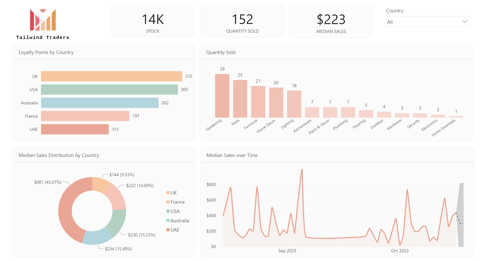
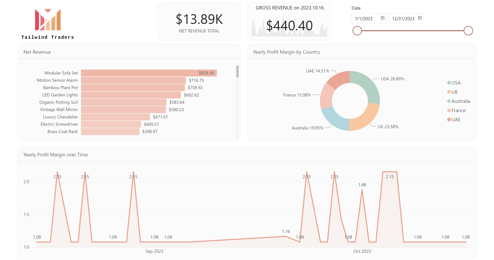

# Microsoft Power BI Data Analyst Certification Capstone Project

### Case:
Tailwind Traders requires a detailed sales report.

### Project Overview:
* Connected multiple data sources and performed ETL procedures,
* Built a data model with the necessary relationships,
* Created required measures, calculations, and a product hierarchy for drill-down functionality,
* Developed a consistent dashboard design with a custom theme. Logo generated using external AI tools,
* Built visualizations across two main pages: Sales Overview and Profit Overview, plus a Drill-Through page for detailed analysis,
* Configured Row-Level Security (RLS). To test it, go to Modeling > View as and select a role.

Additionally, during the project (outside this repository):
* Published the dashboard in Power BI Service for testing,
* Set up development, testing, and production environments,
* Configured notifications and alerts.

To view the interactive report, download the "TW-Sales.pbix" file and open it using Power BI Desktop.

### Screenshots
#### Sales Overview page

#### Profit Overview page

#### Detailed Information page

